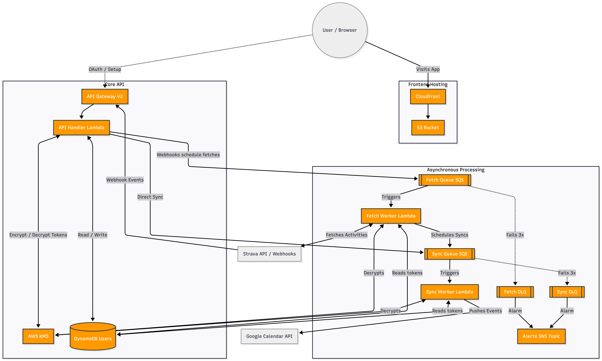

# strava-to-gcal
A bot that listens for Strava activity and pushes events to Google Calendar

## Testing Strategy

### Backend
The backend is tested using **Jest**.
- Run tests: `npm test` (matches `__tests__/**/*.test.js`)
- Mocks external services (Strava, Google Calendar) to ensure valid logic flows.

### Frontend
The frontend (Vite + React) uses a layered testing approach:

1.  **Unit & Integration Tests**: **Vitest** + **React Testing Library**
    *   Fast, headless tests for components and logic.
    *   Run tests: `cd frontend && npm test`
2.  **End-to-End (E2E) Tests**: **Playwright**
    *   Full browser automation to verify critical user journeys.
    *   Run tests: `cd frontend && npm run test:e2e`


## Local Development

### Prerequisites
- [Node.js](https://nodejs.org/) (v22+)
- [AWS CLI](https://aws.amazon.com/cli/) configured with credentials that have access to the deployed stack

### Backend Setup

1. **Configure Environment Variables**:
   Create an `env.json` file in the root directory:
   ```bash
   cp env.json.example env.json
   ```

   Populate it with your credentials. This file is gitignored.

   | Variable | Description | How to get it |
   |---|---|---|
   | `GOOGLE_CLIENT_ID` | Google OAuth 2.0 Client ID | [Google Cloud Console → APIs & Services → Credentials](https://console.cloud.google.com/apis/credentials) |
   | `GOOGLE_CLIENT_SECRET` | Google OAuth 2.0 Client Secret | Same as above |
   | `STRAVA_CLIENT_ID` | Strava API Application ID | [Strava API Settings](https://www.strava.com/settings/api) |
   | `STRAVA_CLIENT_SECRET` | Strava API Client Secret | Same as above |
   | `STRAVA_VERIFY_TOKEN` | Token for Strava webhook verification | Any string you choose (must match what's configured in Strava) |
   | `JWT_SECRET` | Secret for signing JWT session tokens | Any strong random string |
   | `USERS_TABLE_NAME` | DynamoDB table name | From CDK output or AWS Console |
   | `KMS_KEY_ID` | AWS KMS key ID for encrypting user tokens | See below |
   | `LOG_LEVEL` | Logging verbosity (`debug`, `info`, `warn`) | Optional, defaults to `info` |

2. **Fetch the KMS Key ID**:
   The KMS key encrypts user OAuth tokens in DynamoDB. Using the same key locally ensures you can sign in with the same Google account across local dev and AWS:
   ```bash
   aws kms list-aliases \
     --query "Aliases[?AliasName=='alias/StravaToGcalTokens'].TargetKeyId|[0]" \
     --output text
   ```
   Add the output as `KMS_KEY_ID` in your `env.json`.

3. **Start the Backend**:

   **Against real AWS DynamoDB** (uses your `env.json` credentials and KMS key):
   ```bash
   npm run local
   ```

   **With mock in-memory database** (no AWS access needed, good for UI development):
   ```bash
   npm run local:mock
   ```

   The API will be available at `http://localhost:3000`.

### Webhooks Dev Script

An interactive CLI script is provided to manage your Strava webhooks locally (list, create, delete, and test with mock data).
Ensure your `env.json` is configured with your Strava credentials and `STRAVA_VERIFY_TOKEN`.
```bash
npm run webhook-setup
```
If creating a new webhook destination locally, you will need a publicly accessible URL via [ngrok](https://ngrok.com/): `ngrok http 3000`.

### Frontend Setup

1.  **Configure Environment Variables**:
    Navigate to the `frontend` directory and create a `.env` file:
    ```bash
    cd frontend
    cp .env.example .env
    ```
    Update `VITE_API_URL` to point to your local backend (usually `http://127.0.0.1:3000`).

2.  **Start the Frontend**:
    Install dependencies and run the dev server:
    ```bash
    npm install
    npm run dev
    ```
    The app will run at `http://localhost:5173`.

## Deployment

### CI/CD Pipeline
Deployments are automated via **GitHub Actions** and triggered when a release tag is pushed.

**To deploy:**
```bash
git tag v1.0.0
git push origin v1.0.0
```

The pipeline will:
1. Run the test suite
2. Build the frontend
3. Generate `env.json` from GitHub Secrets
4. Deploy infrastructure and application via CDK

### Required GitHub Secrets
Add these in your repo's **Settings → Secrets and variables → Actions**:

| Secret | Description |
|---|---|
| `AWS_ACCESS_KEY_ID` | IAM access key with CDK deploy permissions |
| `AWS_SECRET_ACCESS_KEY` | Corresponding IAM secret key |
| `AWS_REGION` | AWS region (e.g., `us-east-2`) |
| `STRAVA_CLIENT_ID` | Strava API application ID |
| `STRAVA_CLIENT_SECRET` | Strava API client secret |
| `STRAVA_REFRESH_TOKEN` | Strava refresh token |
| `STRAVA_VERIFY_TOKEN` | Strava webhook verification token |
| `GOOGLE_CLIENT_ID` | Google OAuth 2.0 client ID |
| `GOOGLE_CLIENT_SECRET` | Google OAuth 2.0 client secret |
| `KMS_KEY_ID` | AWS KMS key ID for token encryption |
| `ALERT_EMAIL` | Email for CloudWatch alarm notifications |

## System Architecture
